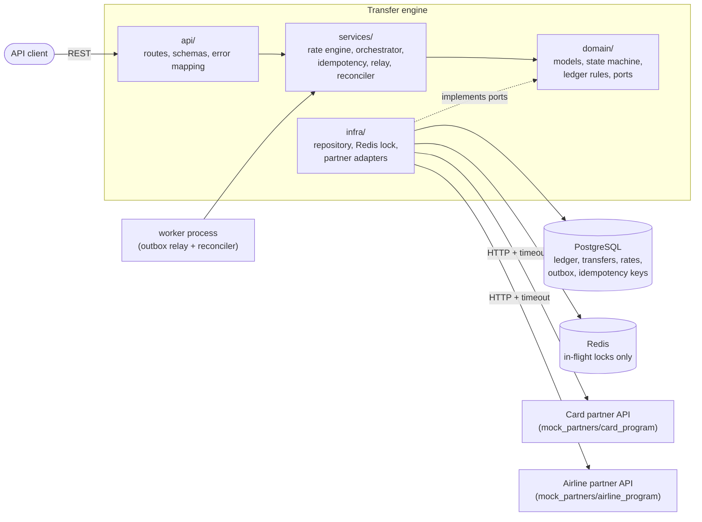
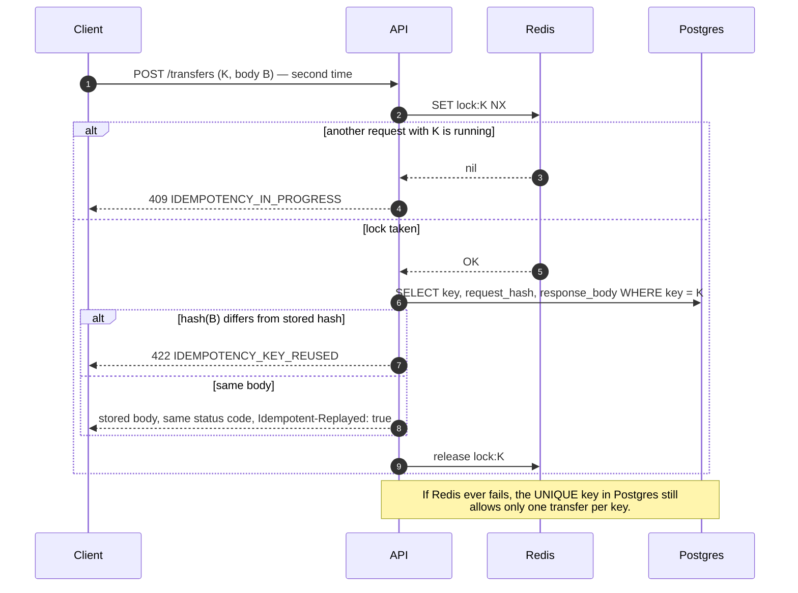
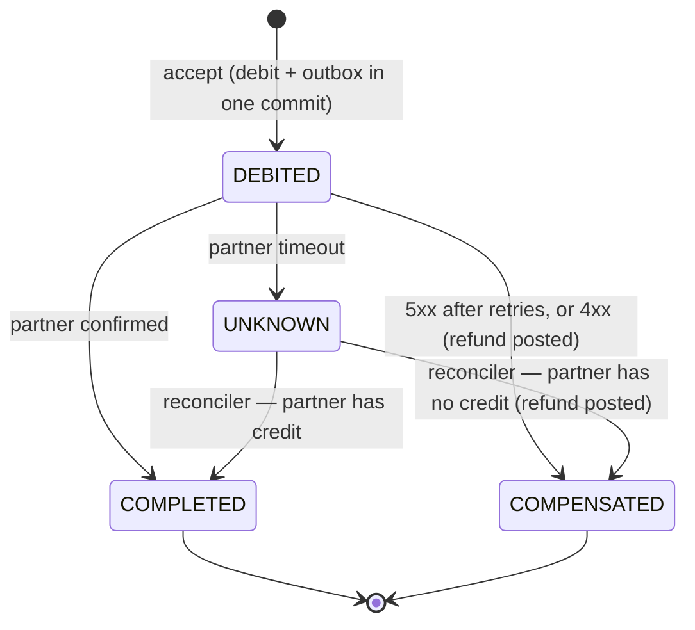
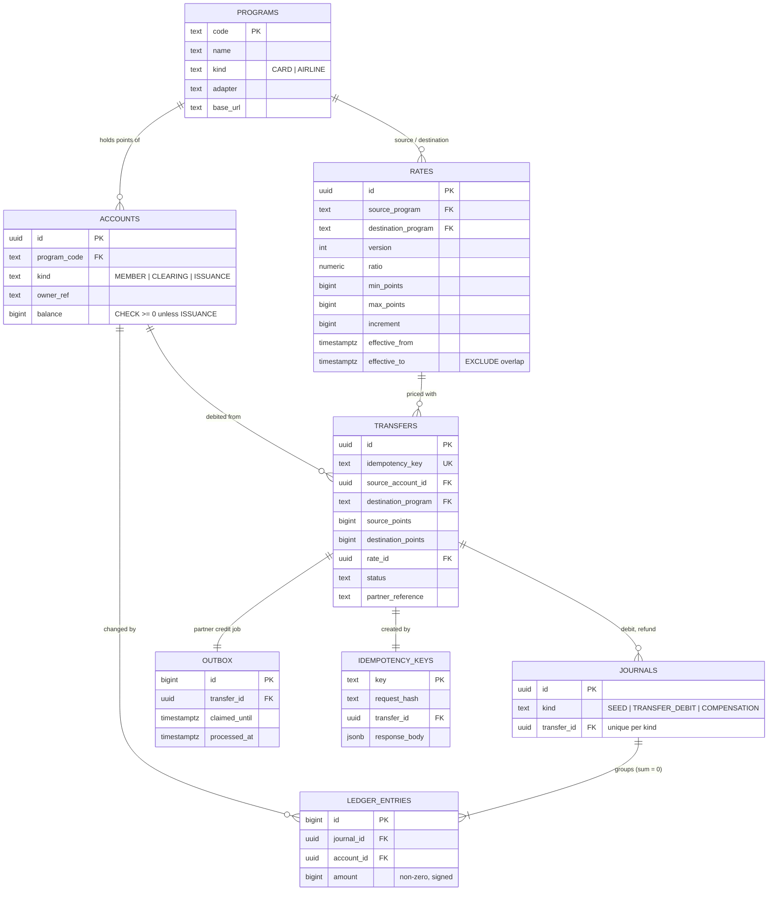

# Architecture

A single Python service moves loyalty points in both directions between credit card
programs and airline programs. Every transfer is a saga: a local debit, a partner
credit, then a commit or a refund. Postgres is the source of truth. Redis only holds
short in-flight locks.

## Component diagram



Dependencies point inward: `api → services → domain ← infra`. `app/main.py`,
`app/worker.py` and `app/bootstrap.py` wire real infrastructure into the services.
`tests/unit/test_layering.py` fails the build if a layer imports an outer one.

## Sequence: happy path

```mermaid
sequenceDiagram
    autonumber
    participant C as Client
    participant A as API
    participant R as Redis
    participant O as Orchestrator
    participant DB as Postgres
    participant P as Partner

    C->>A: POST /transfers (Idempotency-Key: K)
    A->>R: SET lock:K NX EX ttl
    R-->>A: OK
    A->>DB: SELECT idempotency_keys WHERE key = K
    DB-->>A: none
    A->>O: accept()
    O->>DB: BEGIN; lock accounts (id order); check balance
    O->>DB: INSERT transfer (DEBITED), journal (member −N, clearing +N)
    O->>DB: INSERT outbox (lease), INSERT idempotency key; COMMIT
    A->>O: dispatch()
    O->>P: credit(transfer_id, member, points) [timeout, retry on 5xx]
    P-->>O: 201 credit_id
    O->>DB: BEGIN; lock transfer; DEBITED→COMPLETED; outbox done; COMMIT
    A->>DB: save response body for K
    A->>R: release lock:K (only if token matches)
    A-->>C: 201 {status: COMPLETED}
```

## Sequence: partner failure and rollback

```mermaid
sequenceDiagram
    autonumber
    participant C as Client
    participant O as Orchestrator
    participant DB as Postgres
    participant P as Partner

    C->>O: POST /transfers
    O->>DB: COMMIT debit + outbox (status DEBITED)
    loop up to PARTNER_MAX_ATTEMPTS, exponential backoff + jitter
        O->>P: credit()
        P-->>O: 503
    end
    Note over O: all attempts failed (5xx) or partner said 4xx
    O->>DB: BEGIN; lock transfer; DEBITED→COMPENSATED
    O->>DB: lock accounts; journal (clearing −N, member +N); outbox done; COMMIT
    O-->>C: 201 {status: COMPENSATED, failure_reason}
```

## Sequence: timeout and reconcile

```mermaid
sequenceDiagram
    autonumber
    participant C as Client
    participant O as Orchestrator
    participant DB as Postgres
    participant P as Partner
    participant W as Reconciler (worker)

    C->>O: POST /transfers
    O->>DB: COMMIT debit + outbox (DEBITED)
    O->>P: credit()
    Note over O,P: no answer within PARTNER_TIMEOUT_SECONDS
    O->>DB: DEBITED→UNKNOWN (points stay debited); outbox done
    O-->>C: 202 {status: UNKNOWN}

    W->>DB: find UNKNOWN older than RECONCILE_MIN_AGE_SECONDS
    W->>P: GET credit status (transfer_id)
    alt partner has the credit
        P-->>W: 200 credit_id
        W->>DB: lock transfer; UNKNOWN→COMPLETED
    else partner has no record
        P-->>W: 404
        W->>DB: lock transfer; UNKNOWN→COMPENSATED + refund journal
    else partner unreachable
        P-->>W: timeout / 5xx
        Note over W: stay UNKNOWN, try next cycle (never refund blind)
    end
```

## Sequence: idempotent replay



## Crash recovery (transactional outbox)

The debit, the transfer row and the outbox job commit in **one** transaction. The job
starts leased to the request that created it. If that process dies before calling the
partner, the lease expires, and the worker's outbox relay claims the job
(`FOR UPDATE SKIP LOCKED`) and runs the same `dispatch` step. Partners de-duplicate by
transfer id, so a dispatch that runs twice still credits once.

## Transfer state machine



Any other move raises `IllegalTransition` (`app/domain/state_machine.py`).

## Entity relationship diagram



## Money-safety guarantees and where they live

| Guarantee | Enforced by |
|---|---|
| Member/clearing balances never negative | `accounts_no_negative_balance` CHECK + balance check under row lock |
| Every journal sums to zero | `ensure_balanced()` + deferred trigger `ledger_entries_balanced` |
| Whole ledger sums to zero | follows from the rule above; asserted after every integration test |
| One transfer per idempotency key | Redis lock (fast path) + `idempotency_keys` PK + `transfers.idempotency_key` UNIQUE |
| At most one debit and one refund per transfer | `journals_one_kind_per_transfer` partial UNIQUE index |
| No overlapping rate versions | `rates_no_overlap` EXCLUDE constraint |
| No refund while the partner outcome is unknown | state machine + reconciler asks partner first |
